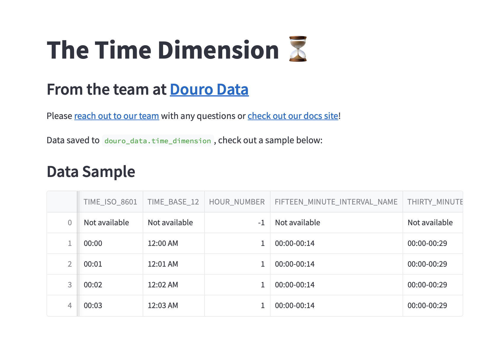

## Time Dimension

This guide should take you from zero to 60 in no time at all.



### Installation

The Time Dimension by Douro has an extremely straight forward installation process, just install the app and the Streamlit UI will guide the setup process with little to no interaction from you.

Once complete, a sample of data should be visible.

### Example Table Usage

Using a time dimension starts as simple as any normal join!

Using the time value, join on `MINUTE_SQL` and unlock the value from every other column. The example below uses a timestamp as the starting point:

```sql
select
time_dim.*
from (
    select date_trunc('minute', cast(current_timestamp() as time))  as test_time
) sample_time
inner join DOURO_TIME_DIMENSION.douro_data.time_dimension time_dim
on sample_time.test_time = time_dim.minute_sql;
```

### Further Details

The separate intervals and ISO standard times are available for you once joined to help group and aggregate data as required.

Please don't hesitate to drop any suggestions or ideas on [our support page](https://www.dourodata.com/support)! Alternatively, you can always contact us at [support@dourodata.com](mailto:support@dourodata.com?subject=Time%20Dimension%20Support).
